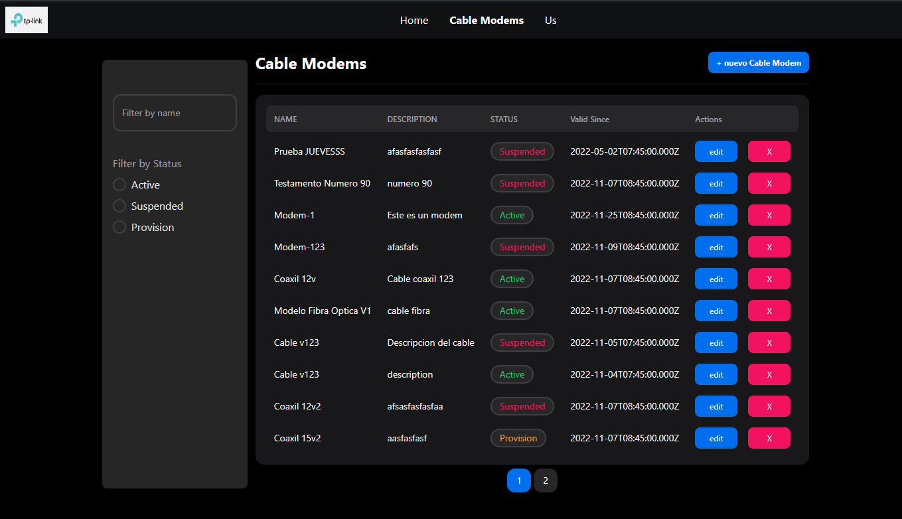

# Stechs-Challenge

Este es un challenge para la empresa Stechs que consiste en construir una pagina utilizando como base Next/React. Para la pagina ademas se utilizan las siguientes tecnologias

- Para los componentes se utiliza la library NextUI.
- Para los tests se utiliza la library Jest.
- Para el hosting de la app se utiliza Vercel.
- Para el backend de la app se decidio utilizar un backend en Node y una base de datos en Mongo.



## Installation

### Install Node.js 

Es necesario tener instalado node version **^18** . Si no lo tenemos instalado podes bajarlo de [nodejs.org](https://nodejs.org/).


### Install NPM

NPM es un manejador de paquetes de **Node** . Si no lo tenemos instalado todavia podemos hacerlo desde [npmjs.com](https://docs.npmjs.com/downloading-and-installing-node-js-and-npm). 


### Clone the repository

```bash
git clone git@github.com:pedroabruno/stechs-challenge-fe.git
```


### Install node app dependencies

Ir a la raiz del proyecto y utilizando **NPM** :

```bash
npm install
```
Este comando bajara e instalara las dependencias del proyecto entre las cuales estan las libraries de Next


## Running the app using cloud backend

Por defecto la app corre contra un backend en **Node** hosteado en **Vercel** y con una db en **Mongo** hosteada en **Mongo Atlas** . 

Para levantar la app utilizando este configuracion correr el comando
```bash
npm run dev
```

## Running the app using local backend 

Para utilizar el backend local se debe
    
-  Clonar el siguiente repositorio : [repo-backend](https://github.com/pedroabruno/stechs-challenge-be)
-  Levantar el backend localmente y copiar la URL del mismo (ruta+puerto)
-  En el archivo src/api/axios.ts modificar la variable `URL_BASE` por la URL del backend

Luego arrojar el siguiente comando en la raiz del proyecto.
```bash
npm run dev
```
Por defecto se levanta una instancia de la app en el puerto 3000. Utilizar la siguiente URL :  [localhost:3000](http://localhost:3000)


## Build

Para ver si la aplicacion buildea correctamente y pasa las pruebas de **lint** se puede utilizar el comando.

```bash
npm run build
```

De esta forma nos aseguramos que la app esta lista para ser deployada.


## Run tests

Para correr los tests se utiliza el comando :

```bash
npm run test
```


## Deploy to Vercel

Para realizar un deploy a Vercel solamente es necesario actualizar el branch main del repositorio. Es decir que con cada push que realizamos a main, Vercel automaticamente se ocupara de obtener la ultima version del branch y realizar el deploy.

[Open Webpage](https://stechs-challenge-fe.vercel.app/)


## Changes and Features

- Se cambia el filtrado de los items de un input y un botton a un input que utilizando debounce para el filtrado de items


## Roadmap

- La db no trabaja de manera totalmente sincronica por lo tanto podriamos cambiarla por una db postgres
- Los strings pasaran a cargarse de un archivo de configuracion dependiendo del idioma elegido
- Se agregara light mode
- Se cambiaran los tipos de datos **any** a tipos de datos explicitos 

## Contributors

<!-- readme: contributors -start -->
<table>
    <tr>
        <td align="center">
            <a href="https://github.com/pedroabruno">
                
                <br />
                <sub><b>Pedro</b></sub>
            </a>
        </td>
    </tr>
</table>